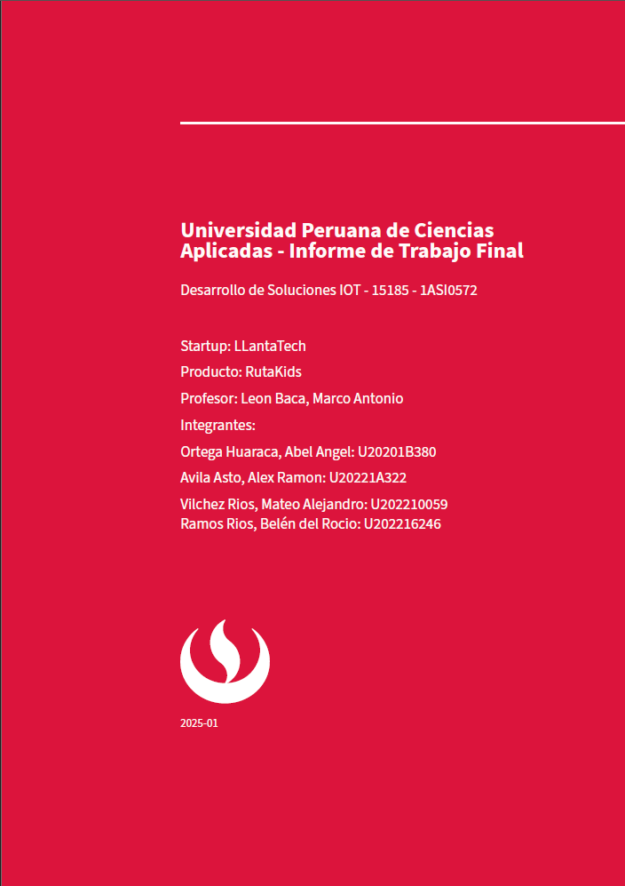

# LLantaTech - Report

**LLantaTech** es una startup dedicada a crear soluciones innovadoras que se ajustan a los estándares y necesidades del público general. Nos especializamos en el desarrollo de tecnologías que priorizan el empleo de elementos Iot y la seguridad de nuestros usuarios, conscientes de que en el mundo digital actual, mejorar procesos con componentes Iot es fundamental. 

## Preview

| Portada del documento | Tabla de contenidos |
| :----------------: | :----------------: |
|  |  |

| Ejemplo de capítulo | Bibliografía |
| :---------------: | :---------------: |
|  |  |

## Advertencia

Para poder visualizar los documentos en formato .pdf, siga los pasos de indicados para la instalación y ejecución de los comando a continuación.

## Instalación

1. Instala pandoc desde <http://pandoc.org/>. También necesitas instalar [LaTeX](https://en.wikibooks.org/wiki/LaTeX/Installation#Distributions).
2. Descarga la última versión de la plantilla Eisvogel desde [la página de lanzamientos](https://github.com/Wandmalfarbe/pandoc-latex-template/releases/latest).
3. Extrae el archivo ZIP descargado y abre la carpeta.
4. Mueve la plantilla `eisvogel.latex` a la carpeta de plantillas de pandoc. La ubicación de la carpeta de plantillas depende de tu sistema operativo:
      - Unix, Linux, macOS: `/Users/USERNAME/.local/share/pandoc/templates/` o `/Users/USERNAME/.pandoc/templates/`
      - Windows Vista o posterior: `C:\Users\USERNAME\AppData\Roaming\pandoc\templates\`

    Si no existen carpetas llamadas `templates` o `pandoc`, necesitas crearlas y poner la plantilla `eisvogel.latex` dentro. Puedes encontrar el directorio de datos de usuario predeterminado en tu sistema observando la salida de `pandoc --version`.

### Imagen de Docker

Alternativamente, si no deseas instalar LaTeX, puedes usar la imagen de Docker llamada [pandoc/extra]. La imagen contiene pandoc, LaTeX y una selección curada de componentes como la plantilla eisvogel, filtros de pandoc y fuentes de código abierto. Un uso común de la imagen se ve así (saltos de línea para mayor legibilidad):

```bash
docker run --rm \
       --volume "$(pwd):/data" \
       --user $(id -u):$(id -g) \
       pandoc/extra example.md -o example.pdf --template eisvogel --listings
```

Para un uso frecuente en la línea de comandos, puedes definir el siguiente alias de shell:

``` bash
alias pandock='docker run --rm -v "$(pwd):/data" -u $(id -u):$(id -g) pandoc/extra'
```

La invocación de ejemplo con Docker desde arriba ahora se ve así:

``` bash
pandock example.md -o example.pdf --template eisvogel --listings
```

[pandoc/extra]: https://hub.docker.com/r/pandoc/extra

## Uso

1. Abre la terminal y navega a la carpeta donde se encuentra tu archivo markdown.

2. Ejecuta el siguiente comando

    ```bash
    pandoc example.md -o example.pdf --from markdown --template eisvogel --listings
    ```

    donde `example.md` es el archivo markdown que quieres convertir a PDF.

```markdown
---
title: "El Título del Documento"
author: [Autor de Ejemplo, Otro Autor]
date: "2017-02-20"
keywords: [Markdown, Ejemplo]
...

Aquí está el texto actual del documento...
```
